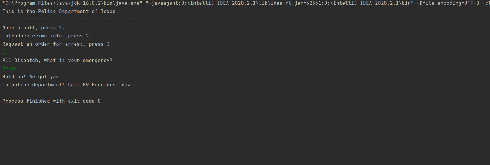

# Topic: Creational Design Patterns:
## Author: Piciriga Bogdan
## Introduction/Theory: 
In software engineering, a design pattern is a general repeatable solution to a commonly occurring problem in software design. A design pattern isn't a finished design that can be transformed directly into code. It is a description or template for how to solve a problem that can be used in many different situations. Creational design patterns are all about class instantiation. This pattern can be further divided into class-creation patterns and object-creational patterns. While class-creation patterns use inheritance effectively in the instantiation process, object-creation patterns use delegation effectively to get the job done.
## Implementation & Exaplanations:
For the implementation of this laboratory work, the Police Department was taken as a model. Its structure was shown with the help of classes: SWAT_Team, PatrolDivision, CrimeSceneUnit, and so on. Three patterns were chosen: factory method, prototype and singleton. 
### Factory method: 
Call for help using the 911 dispatcher. It returns a concrete sub-class depending on the situation: Terrorism, Crime, Robbery, Drugs (check GenerateCall class)
### Prototype:
Creates a new report on new criminal and also sends it to the FBI. (Archives class)
### Singleton: 
Requires an arrest warrant (Administration class)
## Results/Screenshots/Conclusions:

